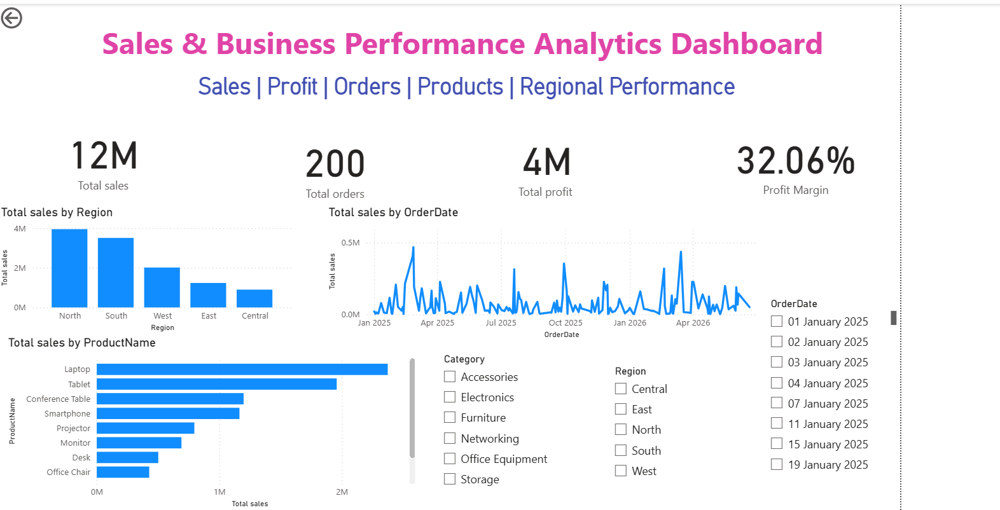

# Sales & Business Performance Analytics Dashboard

## Project Overview
An interactive Power BI dashboard created to analyze sales and business performance.

## Tools Used
- Power BI
- Excel

## Project Objectives
- Monitor key sales and business KPIs
- Analyze product and category performance
- Identify business trends

## Dashboard Preview

## Key Insights
- Total sales reached 12M, with 4M in total profit and a 32.06% profit margin.
- The North region recorded the highest total sales, followed by the South region.
- Laptops generated the highest sales among the listed products, followed by Tablets.
- Sales performance fluctuated across the period from January 2025 to April 2026.

## Files
- Power BI dashboard (.pbix)
- Dashboard screenshot
  
## Note
This project is created for learning and portfolio purposes to demonstrate business analysis, data visualization, and dashboard development using Power BI.

## Author
Tanuja Maddala

GitHub: https://github.com/tanuja-maddala
  
